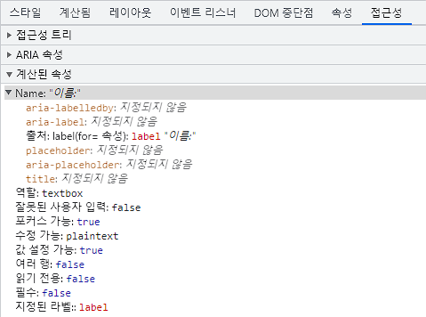
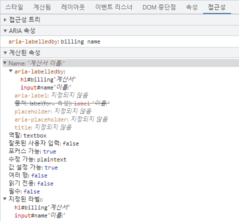
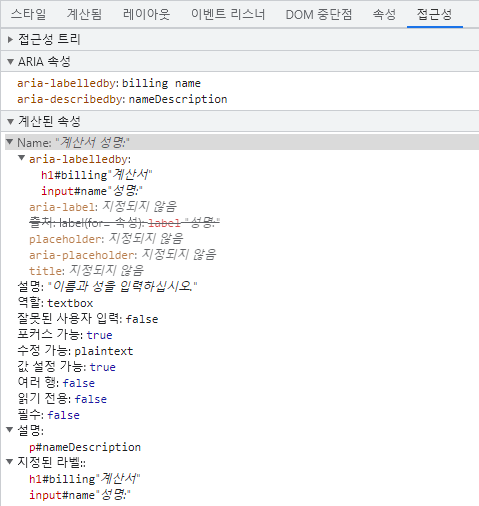

:::warning 현재 이 문서는 번역 작업이 진행중입니다
:::

# 접근성

웹 접근성(a11y)은 장애가 있는 사람, 느린 네트워크 환경(a slow connetion)에 있는 사람, 오래되거나 손상된 하드웨어 또는 단순히 좋지 않은 환경에 있는 사람 등 누구나 사용할 수 있는 웹사이트를 만드는 것을 가르킵니다. 예를 들어, 비디오에 자막을 추가하면 청각 장애인 및 난청 사용자와 시끄러운 환경에서 휴대전화를 들을 수 없는 사용자 모두에게 도움이 됩니다. 마찬가지로 텍스트의 대비가 너무 낮지 않은지 확인하면 시력이 약한 사용자와 밝은 햇빛 아래에서 휴대전화를 사용하려는 사용자 모두에게 도움이 됩니다.

시작할 준비가 되었지만 어디에서 시작할지 모르십니까?

[World Wide Web Consortium (W3C)](https://www.w3.org/)에서 제공하는 [웹 접근성 계획 및 관리 가이드](https://www.w3.org/WAI/planning-and-managing/)를 확인하세요.

## Skip link

사용자가 여러 웹 페이지에서 반복되는 콘텐츠를 건너뛸 수 있도록 각 페이지 상단에 기본 콘텐츠 영역으로 이동하는 링크를 추가해야 합니다.

일반적으로 이것은 모든 페이지에서 포커스 가능한 첫 번째 요소가 되기 때문에 `App.vue` 상단에서 수행됩니다:

```vue-html
<ul class="skip-links">
  <li>
    <a href="#main" ref="skipLink">Skip to main content</a>
  </li>
</ul>
```

포커싱이 되지 않은 링크를 숨기려면 다음 스타일을 추가할 수 있습니다.

```css
.skipLink {
  white-space: nowrap;
  margin: 1em auto;
  top: 0;
  position: fixed;
  left: 50%;
  margin-left: -72px;
  opacity: 0;
}
.skipLink:focus {
  opacity: 1;
  background-color: white;
  padding: 0.5em;
  border: 1px solid black;
}
```

사용자가 경로를 변경하면 포커스를 skip link로 다시 가져옵니다. 이것은 skip link의 template ref에 대한 포커스를 호출하여 수행(archieved)할 수 있습니다. 아래 코드는 `vue-router`를 사용한다고 가정합니다.

<div class="options-api">

```vue
<script>
export default {
  watch: {
    $route() {
      this.$refs.skipLink.focus()
    }
  }
}
</script>
```

</div>
<div class="composition-api">

```vue
<script setup>
import { ref, watch } from 'vue'
import { useRoute } from 'vue-router'

const route = useRoute()
const skipLink = ref()

watch(
  () => route.path,
  () => {
    skipLink.value.focus()
  }
)
</script>
```

</div>

[주요 콘텐츠로 이동하는 링크에 대한 문서 살펴보기](https://www.w3.org/WAI/WCAG21/Techniques/general/G1.html)

## Content Structure

접근성의 가장 중요한 부분 중 하나는 디자인이 접근성 구현을 지원할 수 있는지 확인하는 것입니다. 디자인은 색상 대비, 글꼴 선택, 텍스트 크기 및 언어뿐만 아니라 애플리케이션에서 콘텐츠가 구성되는 방식도 고려해야 합니다.

### Headings

사용자는 제목을 통해 애플리케이션을 탐색할 수 있습니다. 애플리케이션의 모든 섹션에 대한 설명 제목이 있으면 사용자가 각 섹션의 내용을 더 쉽게 예측할 수 있습니다. 제목과 관련하여 몇 가지 권장되는 접근성 방법이 있습니다:

- 순위에 따라 header를 끼어넣기 : `<h1>` - `<h6>`
- 섹션 내에서 제목을 건너뛰지 마세요.
- 제목의 시각적 모양을 제공하기 위해 텍스트 스타일 지정 대신 실제 제목 태그를 사용합니다.

[headings에 대해 살펴보기](https://www.w3.org/TR/UNDERSTANDING-WCAG20/navigation-mechanisms-descriptive.html)

```vue-html
<main role="main" aria-labelledby="main-title">
  <h1 id="main-title">Main title</h1>
  <section aria-labelledby="section-title">
    <h2 id="section-title"> Section Title </h2>
    <h3>Section Subtitle</h3>
    <!-- Content -->
  </section>
  <section aria-labelledby="section-title">
    <h2 id="section-title"> Section Title </h2>
    <h3>Section Subtitle</h3>
    <!-- Content -->
    <h3>Section Subtitle</h3>
    <!-- Content -->
  </section>
</main>
```

### Landmarks

[Landmarks](https://developer.mozilla.org/en-US/docs/Web/Accessibility/ARIA/Roles/landmark_role)는 애플리케이션 내의 섹션에 대한 프로그래밍 방식 액세스를 제공합니다. 보조 기술에 의존하는 사용자는 애플리케이션의 각 섹션으로 이동하여 콘텐츠를 건너뛸 수 있습니다.[ARIA roles](https://developer.mozilla.org/en-US/docs/Web/Accessibility/ARIA/Roles)을 사용하여 이를 달성할 수 있습니다.

| HTML            | ARIA Role            | Landmark Purpose                                                                         |
| --------------- | -------------------- | ---------------------------------------------------------------------------------------- |
| header          | role="banner"        | 주요 제목: 페이지 제목                                                                   |
| nav             | role="navigation"    | 문서나 관련 문서를 탐색할 때 사용하기에 적합한 링크 모음                                 |
| main            | role="main"          | 문서의 주요 또는 중심 내용                                                               |
| footer          | role="contentinfo"   | 상위 문서에 대한 정보: 각주/저작권/개인정보 보호 정책 링크                               |
| aside           | role="complementary" | 주요 내용을 지원하지만, 컨텐츠로부터 분리되어 의미가 있음                                |
| _Not available_ | role="search"        | 애플리케이션에 대한 검색 기능을 포함                                                     |
| form            | role="form"          | 양식 관련 요소 모음                                                                      |
| section         | role="region"        | 관련성이 있고 사용자가 탐색하고 싶어할 것 같은 콘텐츠. 이 요소에 대한 라벨을 제공해야 함 |

:::tip 팁:
[HTML5 시맨틱 요소를 지원하지 않는 레거시 브라우저](https://caniuse.com/#feat=html5semantic)와의 호환성을 최대화하기 위해 중복 랜드마크 역할 속성이 있는 랜드마크 HTML 요소를 사용하는 것이 좋습니다.
:::

[landmarks에 대해 살펴보기](https://www.w3.org/TR/wai-aria-1.2/#landmark_roles)

## Semantic Forms

양식을 작성할 때, 다음 요소를 사용할 수 있습니다.: `<form>`, `<label>`, `<input>`, `<textarea>`, and `<button>`

일반적으로 label은 양식 필드의 상단이나 왼쪽에 배치됩니다:

```vue-html
<form action="/dataCollectionLocation" method="post" autocomplete="on">
  <div v-for="item in formItems" :key="item.id" class="form-item">
    <label :for="item.id">{{ item.label }}: </label>
    <input
      :type="item.type"
      :id="item.id"
      :name="item.id"
      v-model="item.value"
    />
  </div>
  <button type="submit">Submit</button>
</form>
```

<!-- <common-codepen-snippet title="Simple Form" slug="dyNzzWZ" :height="368" tab="js,result" theme="light" :preview="false" :editable="false" /> -->

양식 요소의 모든 입력 요소에 적용되는, 양식 요소에 `autocomplete='on'`를 적용하는 방법을 확인하세요. 각 입력에 대해 서로 다른 [자동 완성 속성값](https://developer.mozilla.org/en-US/docs/Web/HTML/Attributes/autocomplete)을 설정할 수 있습니다.

### Labels

모든 양식 제어에 목적을 설명하는 레이블을 제공하세요; `for`과 `id` 연결:

```vue-html
<label for="name">Name</label>
<input type="text" name="name" id="name" v-model="name" />
```

<!-- <common-codepen-snippet title="Form Label" slug="XWpaaaj" :height="265" tab="js,result" theme="light" :preview="false" :editable="false" /> -->

크롬 개발자 도구에서 이 요소를 검사하고, 요소 탭에서 접근성 탭을 열면, 입력이 레이블에서 이름을 가져오는 것을 볼 수 있습니다:



:::warning 경고:
다음과 같이 레이블이 입력 요소를 감싸아는 것을 보았을 수도 있습니다:

```vue-html
<label>
  Name:
  <input type="text" name="name" id="name" v-model="name" />
</label>
```

ID와 일치하는 label을 명시적으로 설정하는 것이, 보조 기술로부터 보다 더 지원받을 수 있습니다.
:::

#### `aria-label`

[`aria-label`](https://developer.mozilla.org/en-US/docs/Web/Accessibility/ARIA/ARIA_Techniques/Using_the_aria-label_attribute)을 사용하여 입력에 접근성 이름(accessible name)을 지정할 수 있습니다..

```vue-html
<label for="name">Name</label>
<input
  type="text"
  name="name"
  id="name"
  v-model="name"
  :aria-label="nameLabel"
/>
```

<!-- <common-codepen-snippet title="Form ARIA label" slug="NWdvvYQ" :height="265" tab="js,result" theme="light" :preview="false" :editable="false" /> -->

크롬 개발자도구에서 이 요소를 검사하여, 접근성 이름(accessible name)이 어떻게 바뀌는지 확인해도 좋다:


#### `aria-labelledby`

Using [`aria-labelledby`](https://developer.mozilla.org/en-US/docs/Web/Accessibility/ARIA/ARIA_Techniques/Using_the_aria-labelledby_attribute) is similar to `aria-label` except it is used if the label text is visible on screen. It is paired to other elements by their `id` and you can link multiple `id`s:

[`aria-labelledby`](https://developer.mozilla.org/en-US/docs/Web/Accessibility/ARIA/ARIA_Techniques/Using_the_aria-labelledby_attribute)를 사용하는 것은 레이블 문자가 화면에 보인 다는것을 제외하고 `aria-label` 을 사용하는 것과 비슷합니다. 다른 요소의 id를 통해 쌍을 이룰 수 있고, 여러 id에 연결 할 수 있습니다:

```vue-html
<form
  class="demo"
  action="/dataCollectionLocation"
  method="post"
  autocomplete="on"
>
  <h1 id="billing">Billing</h1>
  <div class="form-item">
    <label for="name">Name:</label>
    <input
      type="text"
      name="name"
      id="name"
      v-model="name"
      aria-labelledby="billing name"
    />
  </div>
  <button type="submit">Submit</button>
</form>
```

<!-- <common-codepen-snippet title="Form ARIA labelledby" slug="MWJvvBe" :height="265" tab="js,result" theme="light" :preview="false" :editable="false" /> -->



#### `aria-describedby`

[aria-describedby](https://developer.mozilla.org/en-US/docs/Web/Accessibility/ARIA/ARIA_Techniques/Using_the_aria-describedby_attribute) is used the same way as `aria-labelledby` except provides a description with additional information that the user might need. This can be used to describe the criteria for any input:

[aria-describedby](https://developer.mozilla.org/en-US/docs/Web/Accessibility/ARIA/ARIA_Techniques/Using_the_aria-describedby_attribute) 는 사용자에게 필요할 수 있는 추가적인 정보와 함께 설명을 제공한다는 점을 제외하고는 `aria-labelledby`과 동일한 방식으로 사용됩니다. 이것은 입력에 대한 기준을 설명하는 데 사용할 수 있습니다:

```vue-html
<form
  class="demo"
  action="/dataCollectionLocation"
  method="post"
  autocomplete="on"
>
  <h1 id="billing">Billing</h1>
  <div class="form-item">
    <label for="name">Full Name:</label>
    <input
      type="text"
      name="name"
      id="name"
      v-model="name"
      aria-labelledby="billing name"
      aria-describedby="nameDescription"
    />
    <p id="nameDescription">Please provide first and last name.</p>
  </div>
  <button type="submit">Submit</button>
</form>
```

<!-- <common-codepen-snippet title="Form ARIA describedby" slug="gOgxxQE" :height="265" tab="js,result" theme="light" :preview="false" :editable="false" /> -->

You can see the description by inspecting Chrome DevTools:

크롬 개발자 도구 검사를 통해 설명을 볼 수 있습니다.



### Placeholder

Avoid using placeholders as they can confuse many users.

유저들을 혼란스럽게 할 수 있으므로 placeholders 사용을 피하세요.

One of the issues with placeholders is that they don't meet the [color contrast criteria](https://www.w3.org/WAI/WCAG21/Understanding/contrast-minimum.html) by default;

placeholders의 이슈 중 하나는, 기본적으로 [색상 대비 기준](https://www.w3.org/WAI/WCAG21/Understanding/contrast-minimum.html)을 충족하지 않는 다는 것입니다.

fixing the color contrast makes the placeholder look like pre-populated data in the input fields. Looking at the following example, you can see that the Last Name placeholder which meets the color contrast criteria looks like pre-populated data:

색상 대비를 수정하면 placeholder가 input 영역에 미리 채워진 데이터처럼 보입니다. 다음 예를 보면, 미리 데이터가 채워진것처럼 보이며, 색상 대비 기준을 충족하는 Last Name placeholder를 볼 수 있습니다.

```vue-html
<form
  class="demo"
  action="/dataCollectionLocation"
  method="post"
  autocomplete="on"
>
  <div v-for="item in formItems" :key="item.id" class="form-item">
    <label :for="item.id">{{ item.label }}: </label>
    <input
      type="text"
      :id="item.id"
      :name="item.id"
      v-model="item.value"
      :placeholder="item.placeholder"
    />
  </div>
  <button type="submit">Submit</button>
</form>
```

<!-- <common-codepen-snippet title="Form Placeholder" slug="ExZvvMw" :height="265" tab="js,result" theme="light" :preview="false" :editable="false" /> -->

It is best to provide all the information the user needs to fill out forms outside any inputs.

입력의 외부에 유저가 양식을 채우기 위한 모든 정보를 제공하는 것이 가장 좋습니다.

### Instructions

When adding instructions for your input fields, make sure to link it correctly to the input.

입력 영역에 대해 지시자를 추가할 때, 입력에 올바르게 연결해야 합니다.

You can provide additional instructions and bind multiple ids inside an [`aria-labelledby`](https://developer.mozilla.org/en-US/docs/Web/Accessibility/ARIA/ARIA_Techniques/Using_the_aria-labelledby_attribute). This allows for more flexible design.

추가 지침을 제공하고, [`aria-labelledby`](https://developer.mozilla.org/en-US/docs/Web/Accessibility/ARIA/ARIA_Techniques/Using_the_aria-labelledby_attribute)에 여러 id를 바인딩 할 수 있습니다. 이를 통해 보다 유연한 설계가 가능합니다.

```vue-html
<fieldset>
  <legend>Using aria-labelledby</legend>
  <label id="date-label" for="date">Current Date:</label>
  <input
    type="date"
    name="date"
    id="date"
    aria-labelledby="date-label date-instructions"
  />
  <p id="date-instructions">MM/DD/YYYY</p>
</fieldset>
```

Alternatively, you can attach the instructions to the input with [`aria-describedby`](https://developer.mozilla.org/en-US/docs/Web/Accessibility/ARIA/ARIA_Techniques/Using_the_aria-describedby_attribute):

또는 [`aria-describedby`](https://developer.mozilla.org/en-US/docs/Web/Accessibility/ARIA/ARIA_Techniques/Using_the_aria-describedby_attribute)를 사용하여 입력에 지침을 첨부할 수 있습니다.

```vue-html
<fieldset>
  <legend>Using aria-describedby</legend>
  <label id="dob" for="dob">Date of Birth:</label>
  <input type="date" name="dob" id="dob" aria-describedby="dob-instructions" />
  <p id="dob-instructions">MM/DD/YYYY</p>
</fieldset>
```

<!-- <common-codepen-snippet title="Form Instructions" slug="WNREEqv" :height="265" tab="js,result" theme="light" :preview="false" :editable="false" /> -->

### Hiding Content

Usually it is not recommended to visually hide labels, even if the input has an accessible name.

입력에 접근가능한 이름(accessible name)이 있더라도, 시각적으로 label을 숨기는 것은 일반적으로 권장되지 않습니다.

However, if the functionality of the input can be understood with surrounding content, then we can hide the visual label.

그러나, 입력의 기능을 주변 콘텐츠로 이해할 수 있다면, label을 시각적으로 숨길 수 있습니다.

Let's look at this search field:

아래 검색 영역을 살펴보자.

```vue-html
<form role="search">
  <label for="search" class="hidden-visually">Search: </label>
  <input type="text" name="search" id="search" v-model="search" />
  <button type="submit">Search</button>
</form>
```

We can do this because the search button will help visual users identify the purpose of the input field.

We can use CSS to visually hide elements but keep them available for assistive technology:

```css
.hidden-visually {
  position: absolute;
  overflow: hidden;
  white-space: nowrap;
  margin: 0;
  padding: 0;
  height: 1px;
  width: 1px;
  clip: rect(0 0 0 0);
  clip-path: inset(100%);
}
```

<!-- <common-codepen-snippet title="Form Search" slug="QWdMqWy" :height="265" tab="js,result" theme="light" :preview="false" :editable="false" /> -->

#### `aria-hidden="true"`

Adding `aria-hidden="true"` will hide the element from assistive technology but leave it visually available for other users. Do not use it on focusable elements, purely on decorative, duplicated or offscreen content.

```vue-html
<p>This is not hidden from screen readers.</p>
<p aria-hidden="true">This is hidden from screen readers.</p>
```

### Buttons

When using buttons inside a form, you must set the type to prevent submitting the form.
You can also use an input to create buttons:

```vue-html
<form action="/dataCollectionLocation" method="post" autocomplete="on">
  <!-- Buttons -->
  <button type="button">Cancel</button>
  <button type="submit">Submit</button>

  <!-- Input buttons -->
  <input type="button" value="Cancel" />
  <input type="submit" value="Submit" />
</form>
```

<!-- <common-codepen-snippet title="Form Buttons" slug="JjEyrYZ" :height="467" tab="js,result" theme="light" :preview="false" :editable="false" /> -->

### Functional Images

You can use this technique to create functional images.

- Input fields

  - These images will act as a submit type button on forms

  ```vue-html
  <form role="search">
    <label for="search" class="hidden-visually">Search: </label>
    <input type="text" name="search" id="search" v-model="search" />
    <input
      type="image"
      class="btnImg"
      src="https://img.icons8.com/search"
      alt="Search"
    />
  </form>
  ```

- Icons

```vue-html
<form role="search">
  <label for="searchIcon" class="hidden-visually">Search: </label>
  <input type="text" name="searchIcon" id="searchIcon" v-model="searchIcon" />
  <button type="submit">
    <i class="fas fa-search" aria-hidden="true"></i>
    <span class="hidden-visually">Search</span>
  </button>
</form>
```

<!-- <common-codepen-snippet title="Functional Images" slug="jOyLGqM" :height="265" tab="js,result" theme="light" :preview="false" :editable="false" /> -->

## Standards

The World Wide Web Consortium (W3C) Web Accessibility Initiative (WAI) develops web accessibility standards for the different components:

- [User Agent Accessibility Guidelines (UAAG)](https://www.w3.org/WAI/standards-guidelines/uaag/)
  - web browsers and media players, including some aspects of assistive technologies
- [Authoring Tool Accessibility Guidelines (ATAG)](https://www.w3.org/WAI/standards-guidelines/atag/)
  - authoring tools
- [Web Content Accessibility Guidelines (WCAG)](https://www.w3.org/WAI/standards-guidelines/wcag/)
  - web content - used by developers, authoring tools, and accessibility evaluation tools

### Web Content Accessibility Guidelines (WCAG)

[WCAG 2.1](https://www.w3.org/TR/WCAG21/) extends on [WCAG 2.0](https://www.w3.org/TR/WCAG20/) and allows implementation of new technologies by addressing changes to the web. The W3C encourages use of the most current version of WCAG when developing or updating Web accessibility policies.

#### WCAG 2.1 Four Main Guiding Principles (abbreviated as POUR):

- [Perceivable](https://www.w3.org/TR/WCAG21/#perceivable)
  - Users must be able to perceive the information being presented
- [Operable](https://www.w3.org/TR/WCAG21/#operable)
  - Interface forms, controls, and navigation are operable
- [Understandable](https://www.w3.org/TR/WCAG21/#understandable)
  - Information and the operation of user interface must be understandable to all users
- [Robust](https://www.w3.org/TR/WCAG21/#robust)
  - Users must be able to access the content as technologies advance

#### Web Accessibility Initiative – Accessible Rich Internet Applications (WAI-ARIA)

W3C's WAI-ARIA provides guidance on how to build dynamic content and advanced user interface controls.

- [Accessible Rich Internet Applications (WAI-ARIA) 1.2](https://www.w3.org/TR/wai-aria-1.2/)
- [WAI-ARIA Authoring Practices 1.2](https://www.w3.org/TR/wai-aria-practices-1.2/)

## Resources

### Documentation

- [WCAG 2.0](https://www.w3.org/TR/WCAG20/)
- [WCAG 2.1](https://www.w3.org/TR/WCAG21/)
- [Accessible Rich Internet Applications (WAI-ARIA) 1.2](https://www.w3.org/TR/wai-aria-1.2/)
- [WAI-ARIA Authoring Practices 1.2](https://www.w3.org/TR/wai-aria-practices-1.2/)

### Assistive Technologies

- Screen Readers
  - [NVDA](https://www.nvaccess.org/download/)
  - [VoiceOver](https://www.apple.com/accessibility/mac/vision/)
  - [JAWS](https://www.freedomscientific.com/products/software/jaws/?utm_term=jaws%20screen%20reader&utm_source=adwords&utm_campaign=All+Products&utm_medium=ppc&hsa_tgt=kwd-394361346638&hsa_cam=200218713&hsa_ad=296201131673&hsa_kw=jaws%20screen%20reader&hsa_grp=52663682111&hsa_net=adwords&hsa_mt=e&hsa_src=g&hsa_acc=1684996396&hsa_ver=3&gclid=Cj0KCQjwnv71BRCOARIsAIkxW9HXKQ6kKNQD0q8a_1TXSJXnIuUyb65KJeTWmtS6BH96-5he9dsNq6oaAh6UEALw_wcB)
  - [ChromeVox](https://chrome.google.com/webstore/detail/chromevox-classic-extensi/kgejglhpjiefppelpmljglcjbhoiplfn?hl=en)
- Zooming Tools
  - [MAGic](https://www.freedomscientific.com/products/software/magic/)
  - [ZoomText](https://www.zoomtext.com/)
  - [Magnifier](https://support.microsoft.com/en-us/help/11542/windows-use-magnifier-to-make-things-easier-to-see)

### Testing

- Automated Tools
  - [Lighthouse](https://chrome.google.com/webstore/detail/lighthouse/blipmdconlkpinefehnmjammfjpmpbjk)
  - [WAVE](https://chrome.google.com/webstore/detail/wave-evaluation-tool/jbbplnpkjmmeebjpijfedlgcdilocofh)
- Color Tools
  - [WebAim Color Contrast](https://webaim.org/resources/contrastchecker/)
  - [WebAim Link Color Contrast](https://webaim.org/resources/linkcontrastchecker)
- Other Helpful Tools
  - [HeadingMap](https://chrome.google.com/webstore/detail/headingsmap/flbjommegcjonpdmenkdiocclhjacmbi?hl=en…)
  - [Color Oracle](https://colororacle.org)
  - [Focus Indicator](https://chrome.google.com/webstore/detail/focus-indicator/heeoeadndnhebmfebjccbhmccmaoedlf?hl=en-US…)
  - [NerdeFocus](https://chrome.google.com/webstore/detail/nerdefocus/lpfiljldhgjecfepfljnbjnbjfhennpd?hl=en-US…)

### Users

The World Health Organization estimates that 15% of the world's population has some form of disability, 2-4% of them severely so. That is an estimated 1 billion people worldwide; making people with disabilities the largest minority group in the world.

There are a huge range of disabilities, which can be divided roughly into four categories:

- _[Visual](https://webaim.org/articles/visual/)_ - These users can benefit from the use of screen readers, screen magnification, controlling screen contrast, or braille display.
- _[Auditory](https://webaim.org/articles/auditory/)_ - These users can benefit from captioning, transcripts or sign language video.
- _[Motor](https://webaim.org/articles/motor/)_ - These users can benefit from a range of [assistive technologies for motor impairments](https://webaim.org/articles/motor/assistive): voice recognition software, eye tracking, single-switch access, head wand, sip and puff switch, oversized trackball mouse, adaptive keyboard or other assistive technologies.
- _[Cognitive](https://webaim.org/articles/cognitive/)_ - These users can benefit from supplemental media, structural organization of content, clear and simple writing.

Check out the following links from WebAim to understand from users:

- [Web Accessibility Perspectives: Explore the Impact and Benefits for Everyone](https://www.w3.org/WAI/perspective-videos/)
- [Stories of Web Users](https://www.w3.org/WAI/people-use-web/user-stories/)
